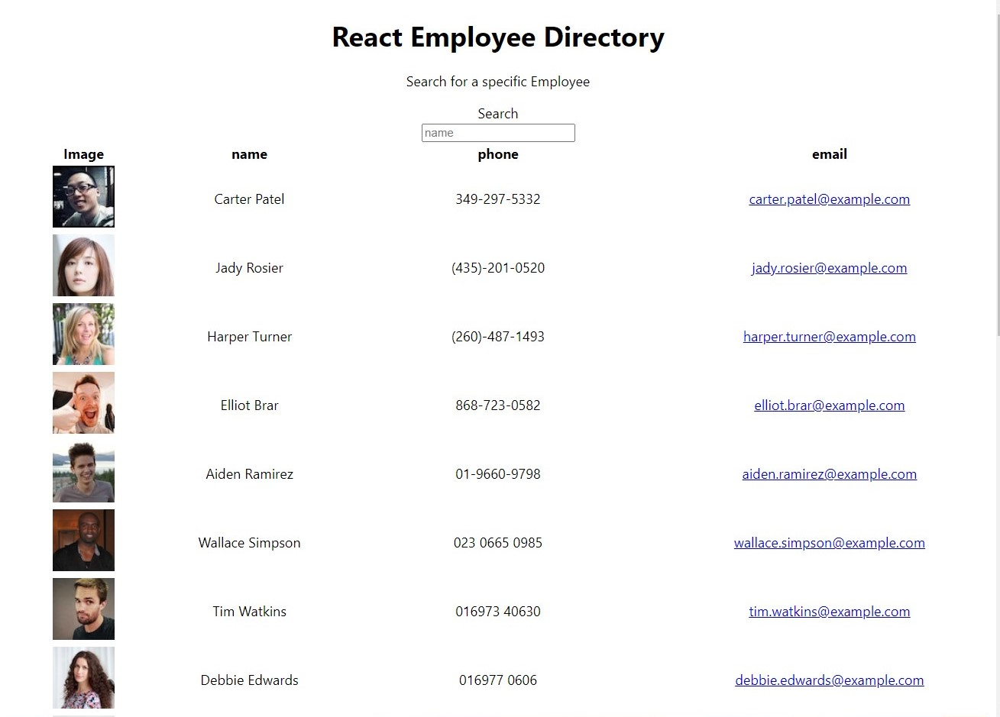

# React Employee Directory
    
## Description: 

The task was to create an app that pulls in a list of 20 random people as employees and render a table with their photo, name, gender and some contact information and make it searchable.
  
    
## Table of Contents: 

* [License](#license)
* [Installation](#installation)
* [Tests](#tests)
* [Usage](#usage)
* [Technology Used](#technology-used)
* [Contributing](#contributing)
* [Questions](#questions)
* [Link](#link)
* [Image](#image)

    
## Installation: 

Use NPM install
    
## Usage: 
    
This app can be used to list and filter employees by name.

## Technology Used: 
    
Technologies used in this application: React, Javascript, HTML5, CSS3, API, Node, Express.
    
## License: 
    
This project is licensed as: Joshua Blank Approved
    
## Contributing: 

There are no special requirements for using this repo.
    
## Tests: 

Be sure to run the following test(s): None
    
## Questions: 
    
If you have any questions, please reach out to [Joshua Blank](https://github.com/Jmnblnk54) @ jmnblnk@yahoo.com.

## Link: 

https://Jmnblnk54/react-emp-dir

## Image:

